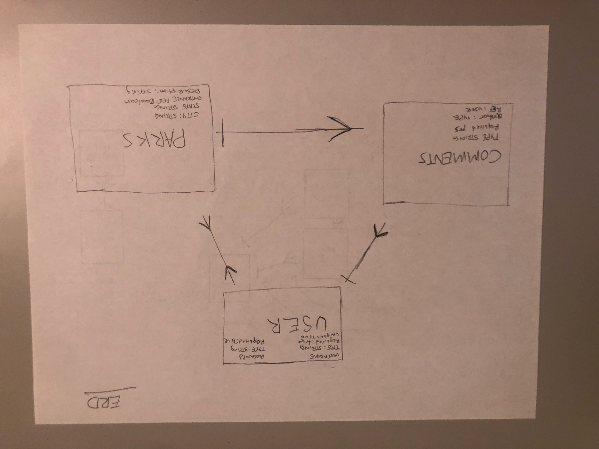
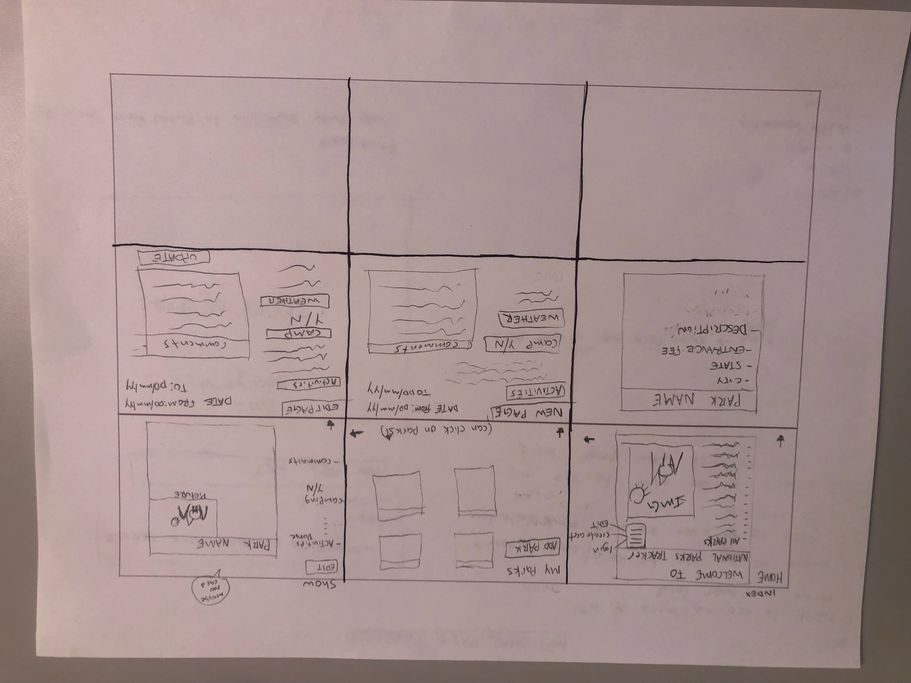
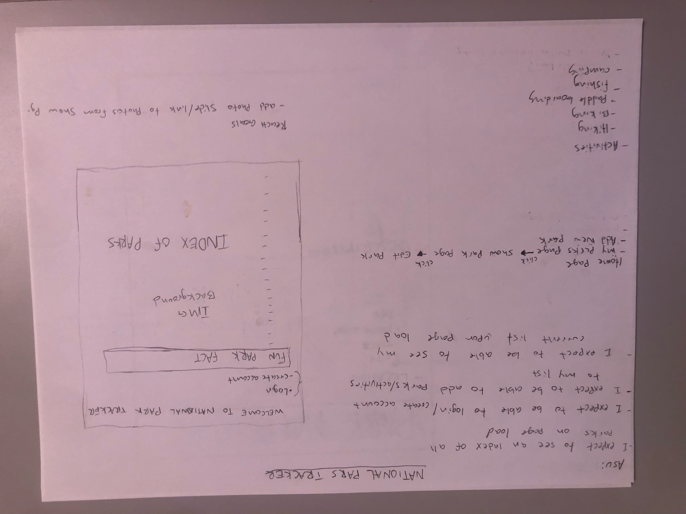
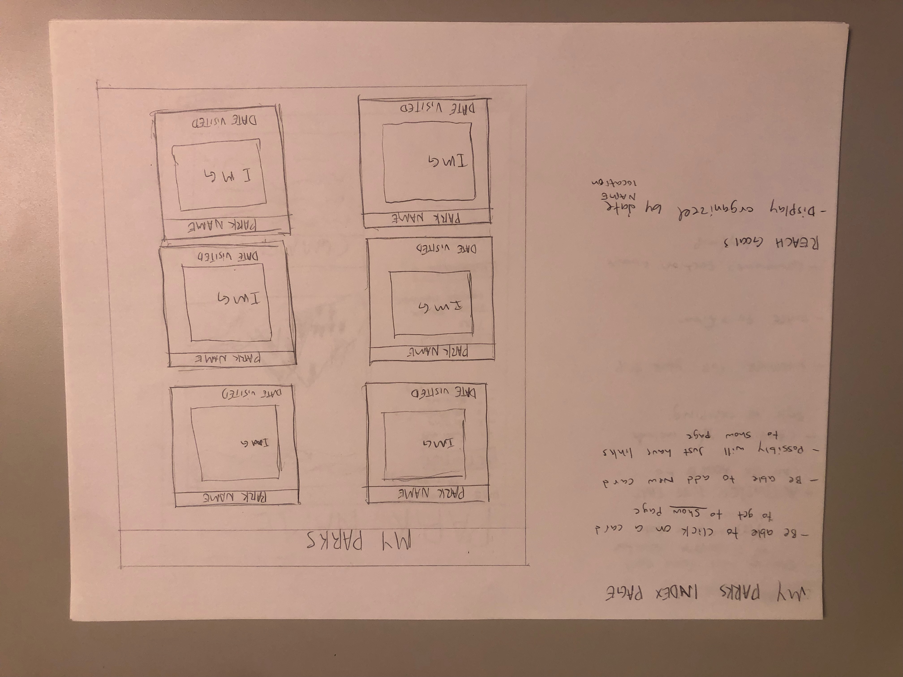
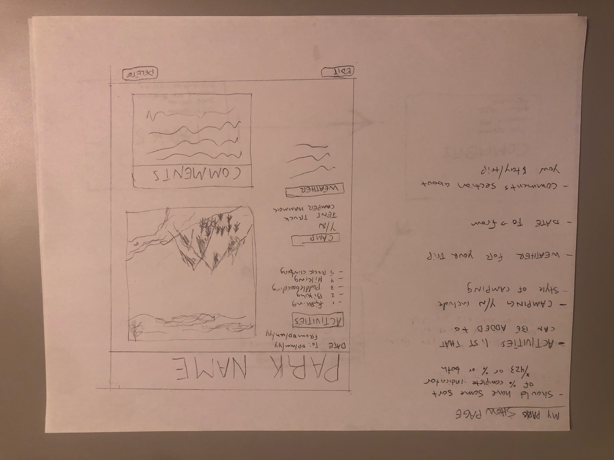

# p2-national-park-tracker
///////////////SUMMARY/////////////////////
A tracker for national parks you've visited

Welcome to the National Tracker, this web site allow you to view all of the National Parks around America. You can view the Parks as a guest user and simply click on one of the park links to get information on that park (name, location, entrance fees and a brief description). 

Create an account to allow you to start your own National Park tracker where you can add in the new parks that you have been to, or if you are already a user with us login back in to edit the Parks you have been to in the past and add new parks that you have visited for the fist time. 

When in your own Parks Tracker you will be able to add/edit information such as activities you did, the weather during your stay, did you camp or not, the dates you were there, and a comments section to record details about your stay.

## API End Points:

| Verb   | URI Pattern            | Controller#Action |
|--------|------------------------|-------------------|
| POST   | `/signup`              | `users#signup`    |
| POST   | `/login`               | `users#login`     |
| GET    | `/logout               | `user#logout      |
| DELETE | `/parks/id:`           | `users#delete`    |
| GET    | `/:id/edit`            | `user#edit`       |
| PUT    | `/:id                  | `user#update`     |
| GET    | `/new`                 | `user#newform`    |
| GET    | `/`                    | `#index`          |
| GET    | `/mine`                | `user#index`      |
| GET    | `/:id`                 | `user#park`       |

## AS A USER (USER STORY):
-view all parks
    -return all parks upon page load
    -commit when this works
-view single park 
    -query for a single park -by ID? (can i use use park name)
    -return the correct park we query for
    -commit when this works
-view all my parks
    -query all parks in collection ()find
    -return all parks
    -commit when this works
-view one of my parks
    -query for a single park -by ID? (can i use use park name)
    -return the correct park we query for
    -commit when this works
-create a park
    -new schema
    -create model to use 
    -return newly created park
    -commit when this works
-update single park inside of my parks
    -query for a single park -by ID?
    -update that single park 
    -return updated park
    -commit when this works
-delete single park
    -query for a single park -by ID?
    -delete or remove a park only from myparks 
    -return proof of success of somehow 
    -commit when this works
-be able to add times visited to a park 
    -default value of some kind (start a zero...)
    -query for a single park -by ID?
    -update liked field 
    -return that updated document 
    -commit when this works
-be able to add comments to single parks
    -search for single park 

## MODELS:
    Schema: 
        -park
            -city - string
            -state - string
            -postal code - number
            -entrance fee - boolean
            -description - string

        -comment
            note:
                type: string
                required: true
            autor:
                type
                ref
        - 

## WIRE FRAMES:

## API:
https://developer.nps.gov/api/v1/parks?api_key=T8iDnVWy0Rzjz6N4p6AK7d5BmPgvqMWNNfOlfjRZ

## TECHNOLOGIES USED:
    "bcryptjs": "^2.4.3",
    "connect-mongo": "^4.6.0",
    "dotenv": "^16.0.1",
    "express": "^4.18.1",
    "express-session": "^1.17.3",
    "liquid": "^5.1.1",
    "liquid-express-views": "^1.0.8",
    "method-override": "^3.0.0",
    "mongoose": "^6.4.4",
    "morgan": "^1.10.0"